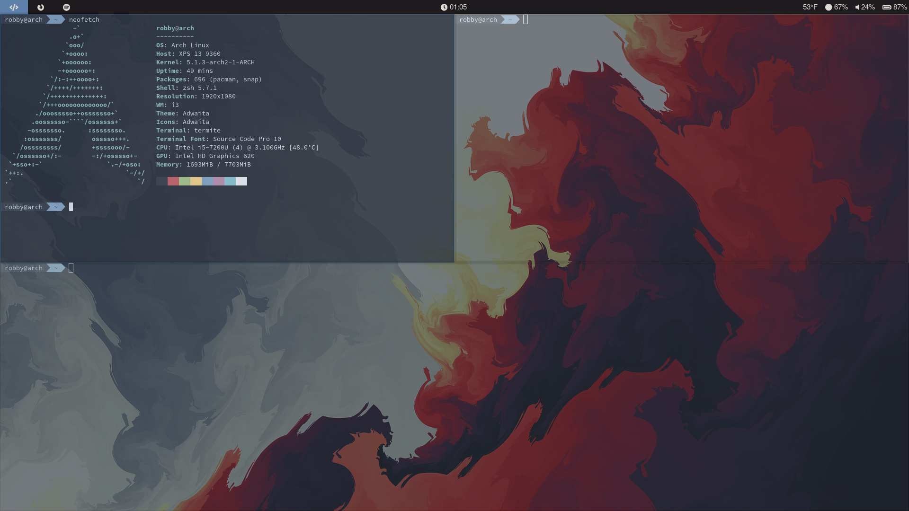

# dotfiles
## OS: Arch Linux  
## i3 + compton + rofi + polybar

My attempt at a simple but complete setup.

Disclaimer: This config is geared towards laptops. Also, some of the video card and screen/keyboard backend lines may need to be changed depending on your laptop's hardware.

