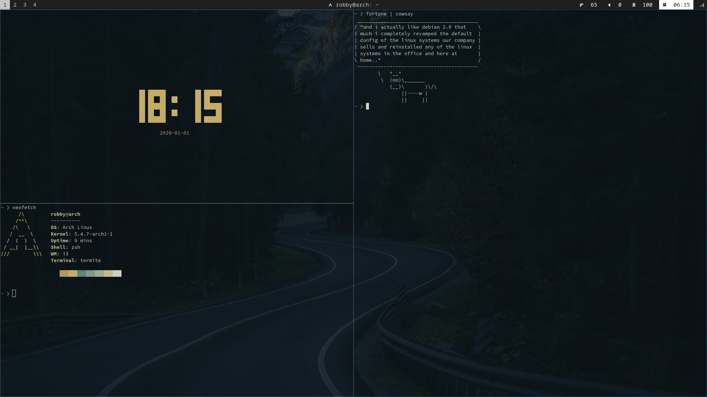

# dotfiles
## OS: Arch Linux  
## i3 + conky + compton + rofi + polybar

My attempt at a no frills, clean looking setup. 

Some fonts that need to be installed:
Source code pro, NotoSansMono Nerd Font, FontAwesome 5 Free(I think FontAwesome 4 causes some conflicts)  
Polybar uses [wedder](https://github.com/awersching/wedder).
.zshrc file is identical to auto generated file, only changing the theme to "agnoster"

Disclaimer: This config is geared towards laptops, as the i3 and polybar configs assume so. Also, some of the video card and screen/keyboard backend lines may need to be changed depending on your laptop's hardware.

